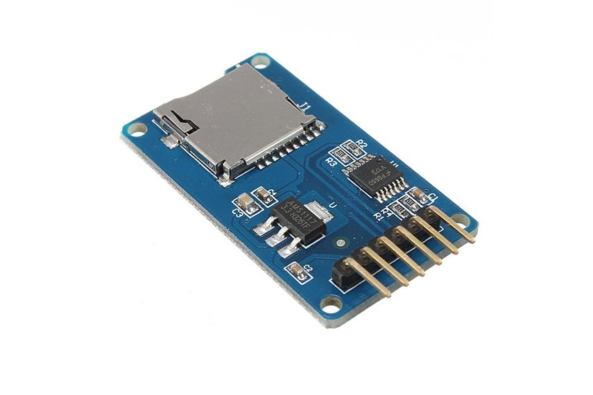

# ArduTracker

WHAT IT IS
WHY IT IS

THE ESP32 BOARD

  

## Software

Arduino IDE

## Circuit

  

### SPI devices

  

### Connecting the nRF24L01 with ESP32

  

nRF24L01 | ESP32
--- | ---
GND | GND
VCC | 3.3V
CE | D4
CSN | D5
SCK | D18
MOSI | D23
MISO | D19

### Connecting the MicroSD Module with ESP32

To connect the SD Module I have adapted a simple Arduino example

  

MicroSD Module | ESP32
--- | ---
GND | GND
VCC | 5V or 3.3V
CS | D22
SCK | D18
MOSI | D23
MISO | D19

  

Explain why the sd card adapter does not play well with others

## Useful links:

### Tutorials
- [Communication nRF24L01 avec cartes ESP32 et ESP8266 ](http://electroniqueamateur.blogspot.com/2019/12/communication-nrf24l01-avec-cartes.html?m=0)
- [https://lastminuteengineers.com/arduino-micro-sd-card-module-tutorial/](https://lastminuteengineers.com/arduino-micro-sd-card-module-tutorial/)

### Circuit
- [ESP32 Fritzing file](https://forum.fritzing.org/t/esp32s-hiletgo-dev-boad-with-pinout-template/5357?u=steelgoose)
