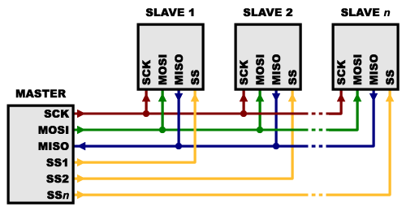

# ArduTracker

WHAT IT IS
WHY IT IS

THE ESP32 BOARD

  

## Software

Arduino IDE

### Additional libraries
- [ArduinoJSON v6](https://arduinojson.org/v6/)

## Circuit

  

### SPI devices

  

### Connecting the nRF24L01 with ESP32

  <table align="center">
    <tr>
      <td>
        <table style="text-align:center">
          <tr style="font-weight: bold;">
            <td>nRF24L01</td>
            <td>ESP32</td>
          </tr>
          <tr>
            <td>GND</td>
            <td>GND</td>
          </tr>
          <tr>
            <td>VCC</td>
            <td>3.3V</td>
          </tr>
          <tr>
            <td>CE</td>
            <td>D4</td>
          </tr>
          <tr>
            <td>CSN</td>
            <td>D5</td>
          </tr>
          <tr>
            <td>SCK</td>
            <td>D18</td>
          </tr>
          <tr>
            <td>MOSI</td>
            <td>D23</td>
          </tr>
          <tr>
            <td>MISO</td>
            <td>D19</td>
          </tr>
        </table>
      </td>
      <td>
        

          
        

      </td>
    </tr>
  </table>

### Connecting the MicroSD Module with ESP32

To connect the SD Module I have adapted a simple Arduino example

  <table align="center">
    <tr>
      <td>
        <table style="text-align:center">
          <tr style="font-weight: bold;">
            <td>MicroSD Module</td>
            <td>ESP32</td>
          </tr>
          <tr>
            <td>GND</td>
            <td>GND</td>
          </tr>
          <tr>
            <td>VCC</td>
            <td>5V or 3.3V</td>
          </tr>
          <tr>
            <td>CS</td>
            <td>D22</td>
          </tr>
          <tr>
            <td>SCK</td>
            <td>D18</td>
          </tr>
          <tr>
            <td>MOSI</td>
            <td>D23</td>
          </tr>
          <tr>
            <td>MISO</td>
            <td>D19</td>
          </tr>
        </table>
      </td>
      <td align="center">
        

          
        

      </td>
    </tr>
  </table>

  

Explain why the sd card adapter does not play well with others

## Useful links:

### Tutorials
- [Communication nRF24L01 avec cartes ESP32 et ESP8266 ](http://electroniqueamateur.blogspot.com/2019/12/communication-nrf24l01-avec-cartes.html?m=0)
- [Interfacing Micro SD Card Module with Arduino](https://lastminuteengineers.com/arduino-micro-sd-card-module-tutorial/)

### Circuit
- [ESP32 Fritzing file](https://forum.fritzing.org/t/esp32s-hiletgo-dev-boad-with-pinout-template/5357?u=steelgoose)
